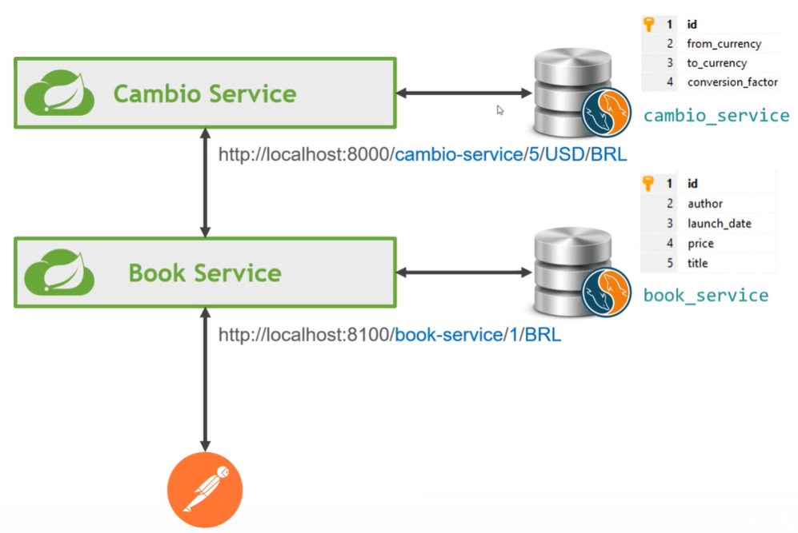
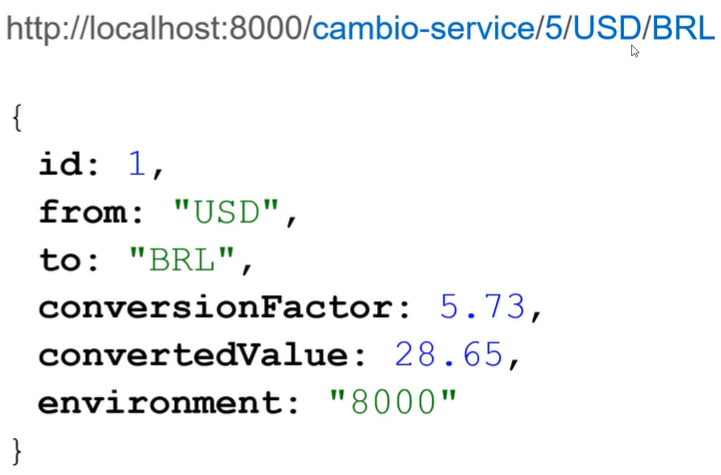
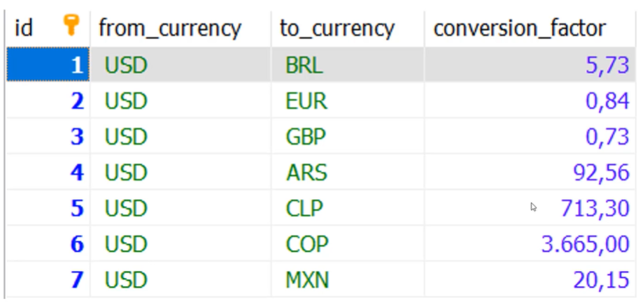
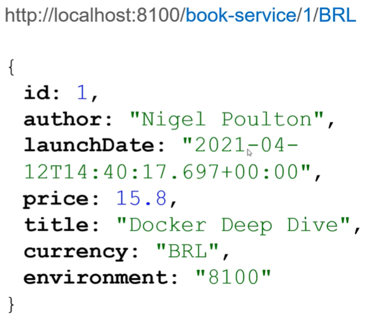
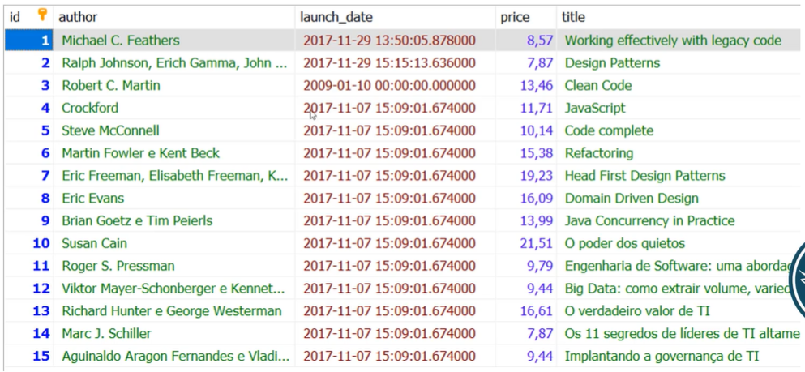

## Project Structure

| Application  |  Port  |
| ------------------- | ------------------- |
|  Greeting Microservice |  8080, 8081, 8082 ...|
|  Spring Cloud Config Server |  8888 |
|  Cambio Microservice |  8000, 8001, 8002 ... |
|  Book Microservice |  8100, 8101, 8102 ... |
|  Netflix Eureka Naming Server |  8671 -> 8761 | 
|  API Gateway |  8125 -> 8765 |
|  Zipkin Distributed Tracing Server |  9411 |

### System structure
The purpose of the system is to make it possible to obtain a book through a microservice and, if necessary, exchange it for a specific currency using another microservice. 

### Microservice structure: cambio-service
The endpoint path must provide the price, source currency and desired currency.

### Database structure | cambio_service table

### Microservice structure: book-service
The endpoint path must provide the book ID and the desired currency.

### Database structure | book_service table
The price column is the book value in dollars.

